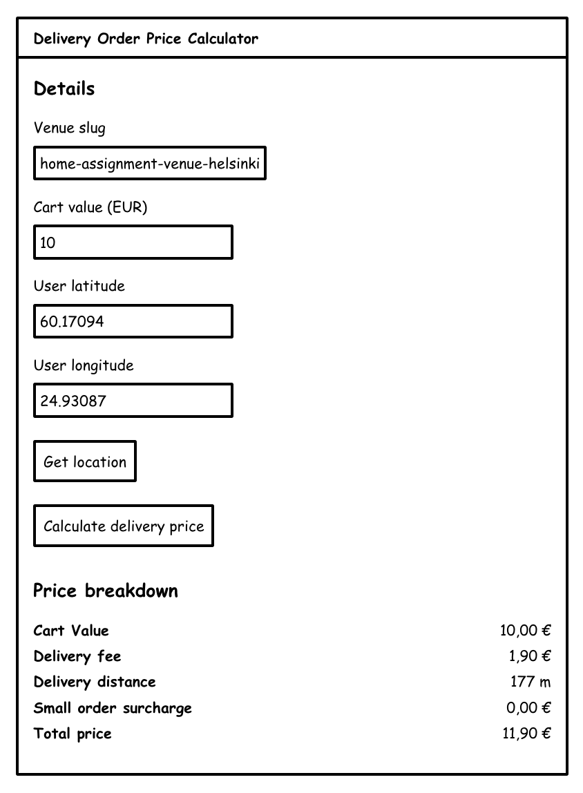

# Wolt 2025 Frontend Engineering Internship

Preliminary Assignment for frontend internships. Welcome! We are delighted to see you applying. Now it's your time to shine.

Note that frontend internship roles are only available in 🇫🇮 and 🇪🇪.

**Please take your time, use the entire time available to complete this to the best of your ability - we do not prioritise submissions by speed!**

## Motivation
The goal of the assignment is to showcase your coding skills and ability to develop realistic features.
This is a highly important part of the hiring process, so it's crucial to put effort into this without making it too bloated.
Based on the results of the assignment review, we will make the decision on whether to proceed to the technical interview.

## Delivery Order Price Calculator UI (DOPC)

Your task is to implement the Delivery Order Price Calculator UI, or DOPC for short!

DOPC is an imaginary frontend which is capable of calculating the total price and price breakdown of a delivery order.

DOPC integrates with the Home Assignment API to fetch venue related data required to calculate the prices.

The term _venue_ refers to any kind of restaurant / shop / store that's in Wolt.

### Specification

Build a delivery order price calculator web app using **React and TypeScript**, which calculates delivery fees and surcharges based on user input and shows the calculated total price to the user.

#### Input fields

The following fields are what the user interacts with in the web application:

| Field          | Type                 | data-test-id  | Description                                                                                                                                                      | Example value                       |
| :------------- | :------------------- | :------------ | :--------------------------------------------------------------------------------------------------------------------------------------------------------------- | ----------------------------------- |
| Venue slug     | text input           | venueSlug     | The venue slug, for which to calculate delivery pricing.                                                                                                         | **home-assignment-venue-helsinki**  |
| Cart value     | text or number input | cartValue     | Value of the shopping cart, in Euro (EUR). For simplicity, consider inputs as having an optional decimal separator of `.`, and no hundreds/thousands separators. | **10**, **10.55**, **100.55** (EUR) |
| User latitude  | text or number input | userLatitude  | The user's latitude.                                                                                                                                             | **60.17094**                        |
| User longitude | text or number input | userLongitude | The user's longitude.                                                                                                                                            | **24.93087**                        |
| Get location   | button               | getLocation   | On activation, gets the user's current location, and populates the latitude and longitude fields                                                                 | N/A                                 |
| Calculate delivery price | button | calculateDeliveryPrice | On activation, prompts the calculation of the delivery price | N/A |

For the "text or number" inputs, we recognise that there are multiple ways to implement them in HTML, and leave the exact attributes to your judgement.

Inputs should be validated, and feedback should be provided to the user, as appropriate.

#### Inputs and test ids

When creating web interfaces, it's important to ensure accessibility and ease of testing.

For each `Field` in the table above, ensure that the root element containing the value, typically an `input` element, includes a `data-test-id` attribute.
This attribute is used for identifying elements during automated testing. The value of `data-test-id` should be the camelCase version of the `Field` listed in the table. For example, the field `Cart value` in the table should correspond to `data-test-id="cartValue"`.

#### Outputs

The core algorithm for calculating the price produces the following output for the UI:

| Label                 | Description                                              | Example value |
| :-------------------- | -------------------------------------------------------- | ------------- |
| Cart value            | The cart value, in EUR, formatted.                       | **10 EUR**    |
| Small order surcharge | The calculated small order surcharge, in EUR, formatted. | **0 EUR**     |
| Delivery fee          | The calculated delivery fee, formatted.                  | **1.90 EUR**  |
| Delivery distance     | The calculated delivery distance, in meters, formatted   | **177 m**     |
| Total price           | The calculated total price, in EUR, formatted.           | **11.90 EUR** |

The display/output formatting is open-ended; for example, you can consider the user's locale when displaying currency and distance. However, we do not expect you to implement support for other currencies than euro.

To facilitate testing, the wrapper of a formatted value should contain the "raw" value in a `data-raw-value` attribute, such as `<span data-raw-value="1055">10.55 EUR</span>` or `<span data-raw-value="700">700 m</span>`. The money related "raw" values should be in cents and the delivery distance in meters.

#### Output example

Feel free to design and implement the user interface how you want. Below is an example of what it could look like.

When reviewing the assignment, we are focusing on the code quality and structure of your app. However, good UX & design will definitely give you bonus points. We also encourage you to consider accessibility in your implementation, as that topic is close to our hearts here at Wolt. Crafting an accessible design and writing accessible code are the kind of good development practices we value.



#### Implementation Details

Let's look at how to produce the described output from the input values.

##### Example

Assuming some parsing of the fields, and an internal representation of:

```json
{
  "venueSlug": "home-assignment-venue-helsinki",
  "cartValue": 1000,
  "userLatitude": 60.17094,
  "userLongitude": 24.93087
}
```

The algorithm described here would produce:

```json
{
  "cartValue": 1000,
  "smallOrderSurcharge": 0,
  "deliveryFee": 190,
  "deliveryDistance": 177,
  "totalPrice": 1190
}
```

##### Home Assignment API

In order to calculate the values needed for the response, DOPC should request data from _Home Assignment API_ which is an imaginary backend service.
Fortunately, it's already implemented, so you can use it right away!
It provides two JSON endpoints:

- Static information about a venue: `https://consumer-api.development.dev.woltapi.com/home-assignment-api/v1/venues/<VENUE SLUG>/static`, examples:
  - 🇫🇮 <https://consumer-api.development.dev.woltapi.com/home-assignment-api/v1/venues/home-assignment-venue-helsinki/static>
  - 🇪🇪 <https://consumer-api.development.dev.woltapi.com/home-assignment-api/v1/venues/home-assignment-venue-tallinn/static>
- Dynamic information about a venue: `https://consumer-api.development.dev.woltapi.com/home-assignment-api/v1/venues/<VENUE SLUG>/dynamic`, examples:
  - 🇫🇮 <https://consumer-api.development.dev.woltapi.com/home-assignment-api/v1/venues/home-assignment-venue-helsinki/dynamic>
  - 🇪🇪 <https://consumer-api.development.dev.woltapi.com/home-assignment-api/v1/venues/home-assignment-venue-tallinn/dynamic>

Feel free to use any of these venue slugs during development:
- home-assignment-venue-helsinki
- home-assignment-venue-tallinn

However, note that in real world there could be thousands of different venues so your implementation should work in general case.

If you open the examples in the browser, you can see that both of the endpoints return quite a bit of data.
But don't worry, we only care about a couple of the fields in the scope of this assignment; you can ignore the rest.
Here are the relevant fields:

| Endpoint | Location of the important field in the response JSON payload       | Explanation                                                                                               |
| -------- | ------------------------------------------------------------------ | --------------------------------------------------------------------------------------------------------- |
| /static  | venue_raw -> location -> coordinates                               | Location of the venue: [longitude, latitude]                                                              |
| /dynamic | venue_raw -> delivery_specs -> order_minimum_no_surcharge          | The minimum cart value to avoid small order surcharge                                                     |
| /dynamic | venue_raw -> delivery_specs -> delivery_pricing -> base_price      | The base price for delivery fee                                                                           |
| /dynamic | venue_raw -> delivery_specs -> delivery_pricing -> distance_ranges | The distance ranges for calculating distance based component for the delivery fee. More about this below. |

You can assume that all the fields mentioned above are always present in the response payload of the corresponding endpoint if the response status code is 200.

The structure of `distance_ranges` looks something like this:

```json
"distance_ranges": [
  {
    "min": 0,
    "max": 500,
    "a": 0,
    "b": 0,
    "flag": null
  },
  {
    "min": 500,
    "max": 1000,
    "a": 100,
    "b": 1,
    "flag": null
  },
  {
    "min": 1000,
    "max": 0,
    "a": 0,
    "b": 0,
    "flag": null
  }
]
```

Each object inside `distance_ranges` list contains the following:

- `min`: The lower (inclusive) bound for the distance range in meters
- `max`: The upper (exclusive) bound for the distance range in meters. `"max": 0` means that the delivery is not available for delivery distances equal or longer the value of `min` in that object.
- `a`: A constant amount to be added to the delivery fee on top of the base price
- `b`: Multiplier to be used for calculating distance based component of the delivery fee. `b` is factored in to the delivery fee by adding `b * distance / 10` (rounded to the nearest integer value). For example, if the delivery distance is 1000 meters and the value of `b` is 2, we'd add 200 (`2 * 1000 / 10`) to the delivery fee.
- `flag`: You can ignore this field

You can assume that the order of the objects inside `distance_ranges` is sorted by `min`.
You can also assume that the value for `min` is the same as the value for `max` in the previous object in the list.
Also, the first object in the list always has `"min": 0` and the last object has `"max": 0`.

For example, given the above `distance_ranges` example, if the delivery distance were 600 meters and the `base_price` were 199, the delivery fee would be 359 (base_price + a + b * distance / 10 == 199 + 100 + 1 * 600 / 10 == 359).
Another example: if the delivery distance were 1000 meters or more, the delivery would not be possible.

**All the money related information (prices, fees, etc) are in the lowest denomination of the local currency. In euro countries they are in cents.**

##### Building the logic

Here's some guidance for getting the logic and calculations right:

- `smallOrderSurcharge` is the difference between `order_minimum_no_surcharge` (as received from the Home Assignment API) and the cart value. For example, if the cart value is 800 and `order_minimum_no_surcharge` is 1000, then the `smallOrderSurcharge` is 200. `smallOrderSurcharge` can't be negative.
- Delivery distance is the straight line distance between the user's and venue's locations. Note that it's straight line distance, you don't need to figure out what's the distance via public roads. The exact algorithm doesn't matter as long as it's a decent approximation of a straight line distance.
- Delivery fee can be calculated with: `base_price + a + (b * distance / 10)`. Please read carefully the details above in the "Home Assignment API" section.
- Total price is the sum of cart value, small order surcharge, and delivery fee.
- If the delivery is not possible, for example if the delivery distance is too long, the UI should show an error, with explanatory information.

### Expectations

We expect you to:

- Implement the UI in **TypeScript and React**
- Use frameworks and libraries of your choice
- Follow the specification described above
  - Ensure that you have implemented `data-test-id` and `data-raw-value`, to facilitate automated testing.
- Implement tests for your solution
- Document the installation and running instructions
- Consider that this could be a real world project so the code quality should be on the level that you'd be happy to contribute in our real projects
- Use your own judgement in case you discover an edge case which is not explicitly documented in the specification above

We **do not** expect you to:

- Implement any additional features which are not described in this assignment description
- Implement support for different currencies
- Introduce authentication or monitoring or continuous integration or any kind of persistence (e.g. database)
- Deploy your solution

### Submitting the solution

Bundle your project into a Zip archive and upload it to Google Drive, Dropbox or similar and send a link to the recruiter.
Remember to check permissions!
If we cannot access the file, we cannot review your code.
Please don't store your solution in a public GitHub repository.

A good check before sending your solution is to unzip the Zip archive into a new folder and check that building and running the project works, using the steps you had written in the README.md of your project.

## Q&A

> We'll keep adding common questions and answers here as they come up.
